# xbsky
A simple Bluesky embed fixer for Telegram and Discord, written in Go

# Usage
Add an `x` before `bsky.app`, so it becomes `xbsky.app`

### Want the raw/direct media only?

Add `raw` before `xbsky.app`, so it becomes `raw.xbsky.app`

### A post has multiple images, but you want a combined one?

Add `mosaic` before `xbsky.app`, so it becomes `mosaic.xbsky.app`

# Gallery

A text only post

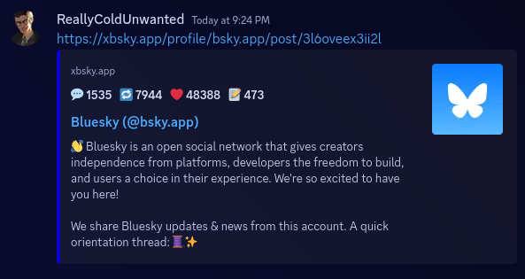
 

A text only post, it also works with a spoiler tag

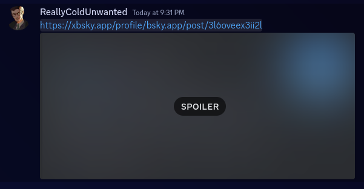
 

A text only, reply post. It embeds the parent's image

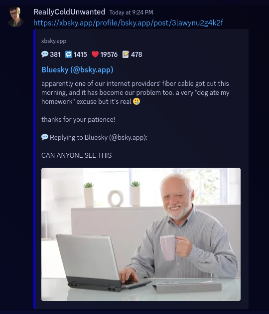
 

A text only, reply post. It embeds the parent's video (text is cut off due to Discord limits, and replaced with <code>...</code>)

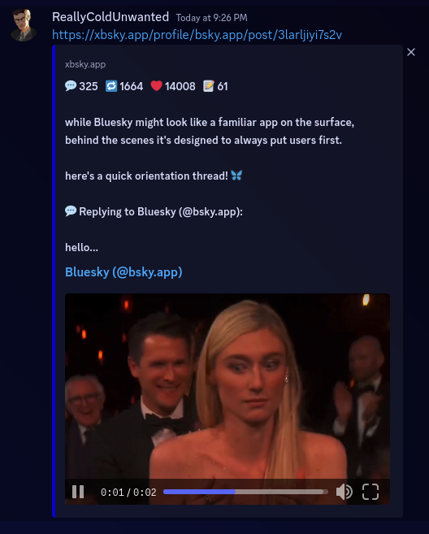
 

A text only post that has an external embed (in this case, a link to Twitch), it embeds external metadata (title, description, image if available)

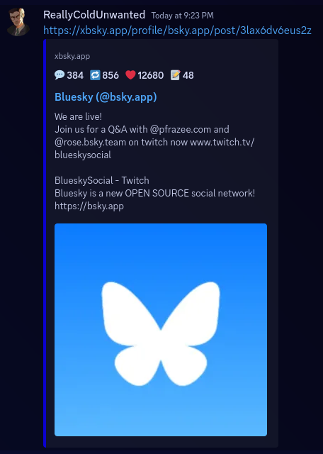
 

A profile embed

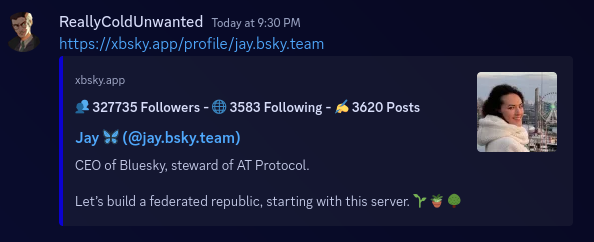
 

A profile embed, it also works with a spoiler tag

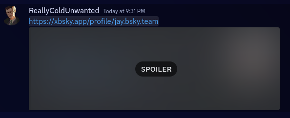
 

A text only post with an external embed (Telegram)

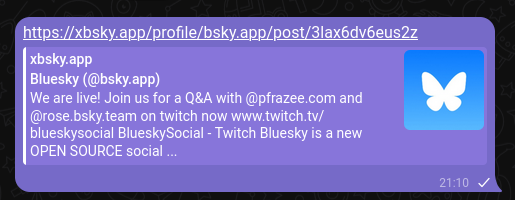
 

A text only, quote post (Telegram)

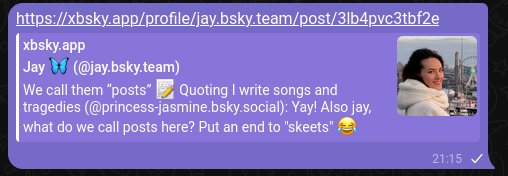
 

A reply post with two images, horizontally stacked for the image preview (Telegram only; all images are available in Instant View)

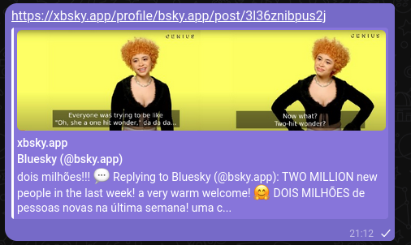
 

A video post (Telegram)

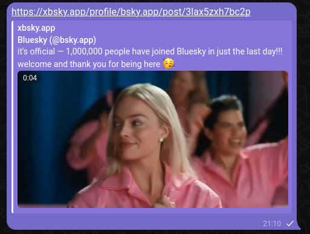
 

# Note
- This project was done as practice, if you encounter any bugs, errors, or whatnot, feel free to reach out to me:
    - On [Discord (@reallycoldunwanted)](https://discord.com/users/928010351583330414)
    - On [Bluesky (@coldunwanted.net)](https://bsky.app/profile/coldunwanted.net)
    - Or, of course, [here on GitHub](https://github.com/colduw/xbsky/issues)
