# xbsky
A simple Bluesky embed fixer for Telegram and Discord, written in Go

# Usage
Add an `x` before `bsky.app`, so it becomes `xbsky.app`

### Want the raw/direct media only?

Add `raw` before `xbsky.app`, so it becomes `raw.xbsky.app`

### A post has multiple images, but you want a combined one?

Add `mosaic` before `xbsky.app`, so it becomes `mosaic.xbsky.app`

### A post has multiple images, but you only want to select a specific one?

Add `/photo/(desired image number)` after the record key, so it becomes `xbsky.app/profile/handle.bsky.social/post/recordkey/photo/(desired image number)`

ie: <code>xbsky.app/profile/handle.bsky.social/post/recordkey/photo/1</code> to select the first image

### For developers:

Use `api.xbsky.app` to get a [parsed struct](https://github.com/colduw/xbsky/blob/main/main.go#L242) (`parsedData` field) about the post's information, as well as the [original struct](https://github.com/colduw/xbsky/blob/main/main.go#L40) (`originalData` field) that was used to create the parsed struct.

Responses will have a `Content-Type: application/json`, and `200 OK` status code on success

# Gallery

A text only post

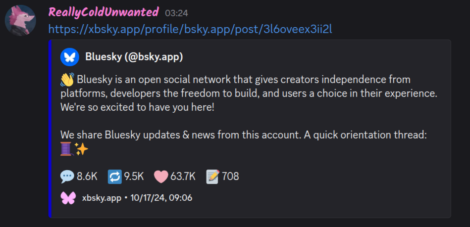
 

A text only post, everything also works with a spoiler tag

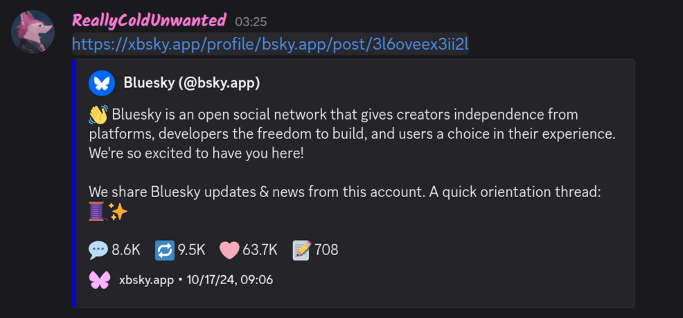
 

A text only, reply post. It embeds the parent's image

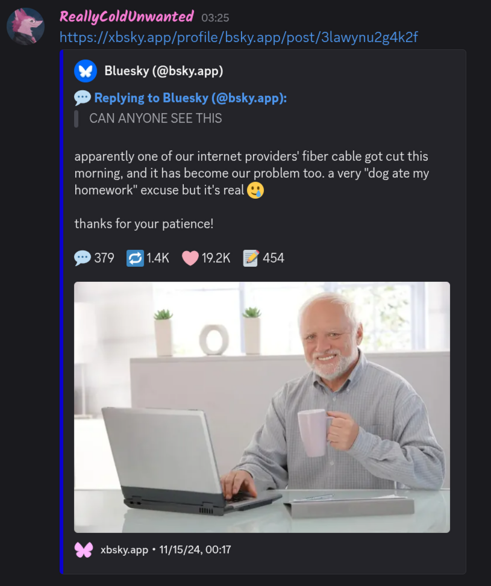
 

A text only, reply post. (if possible) It embeds the parent's/quoted post's video

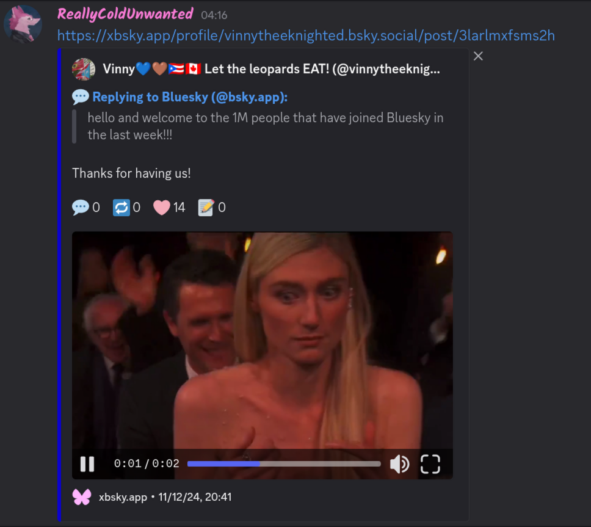
 

A feed embed

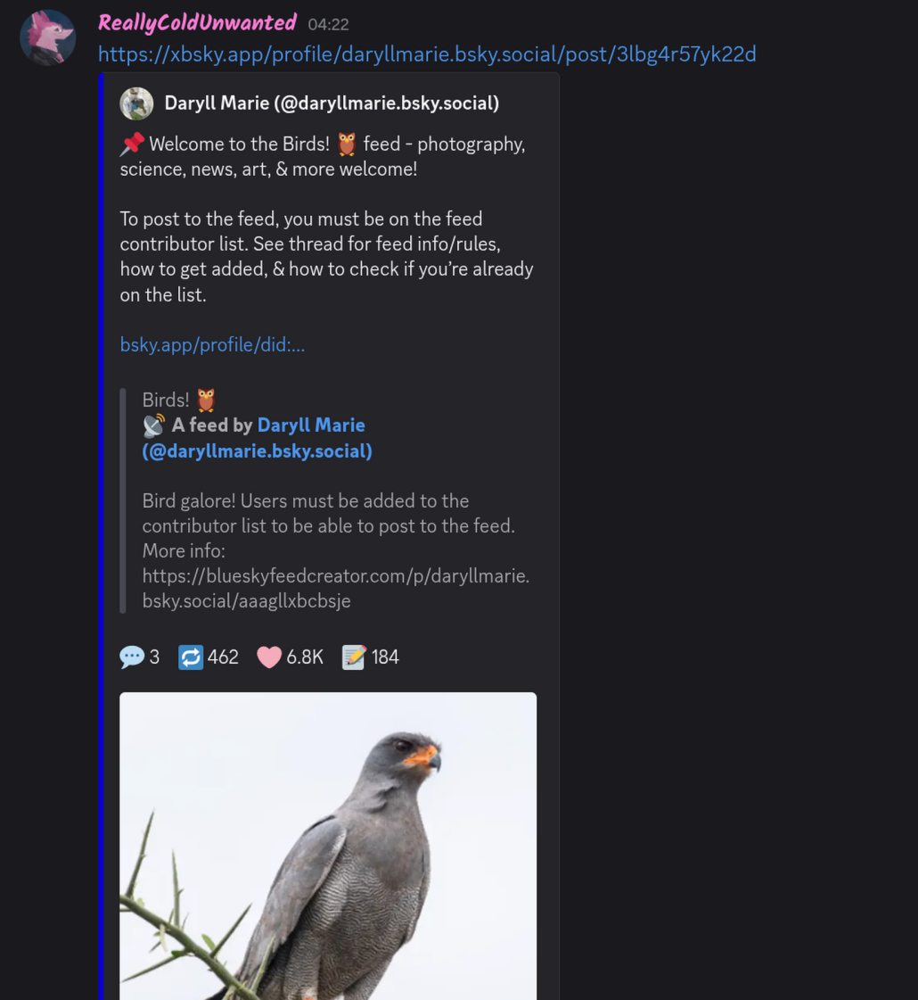
 

A list embed (also works with moderation lists)

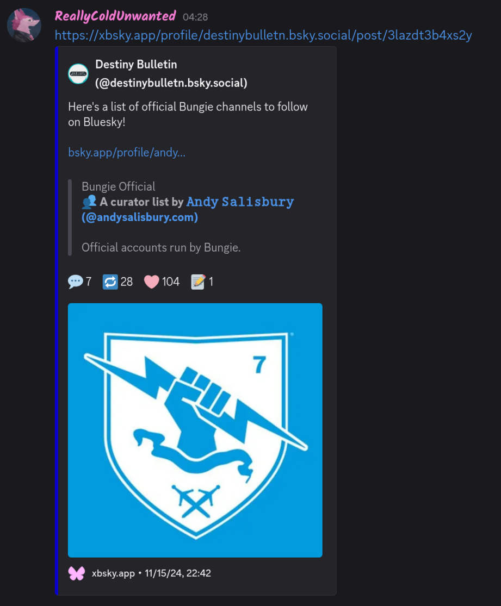
 

A starter pack embed

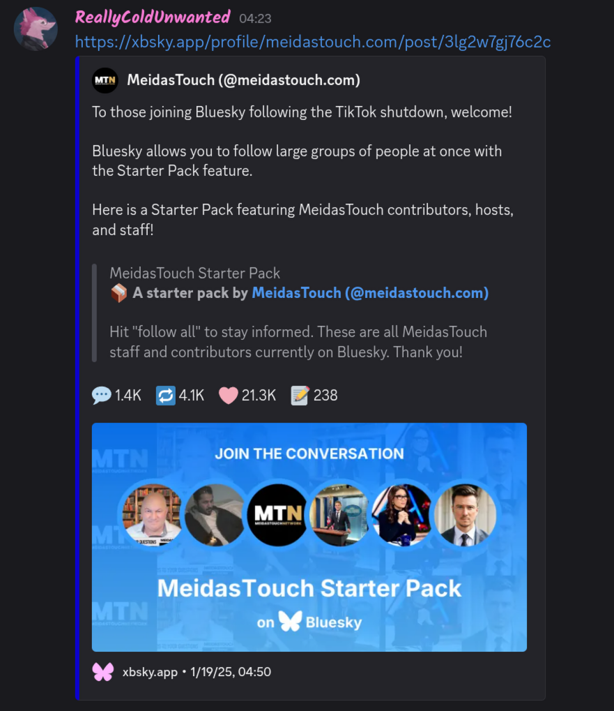
 

A text only post that has an external embed (in this case, a link to Twitch), it embeds external metadata (title, description, image if available)

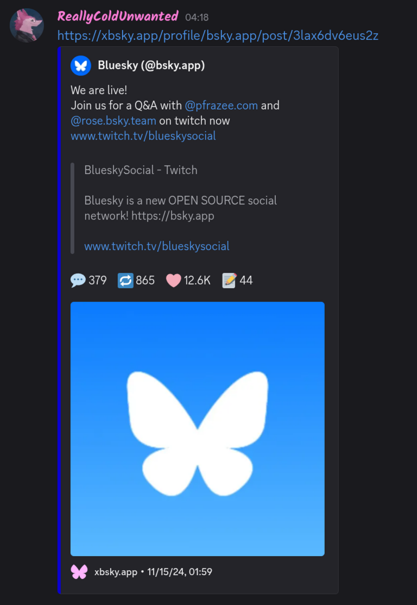
 

A profile embed

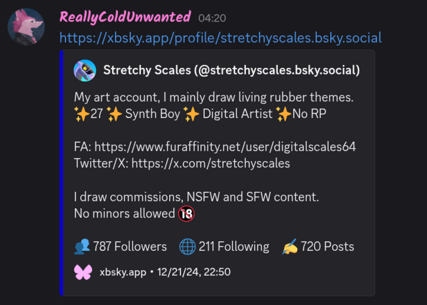
 

Supported with shortened URL variations as well.

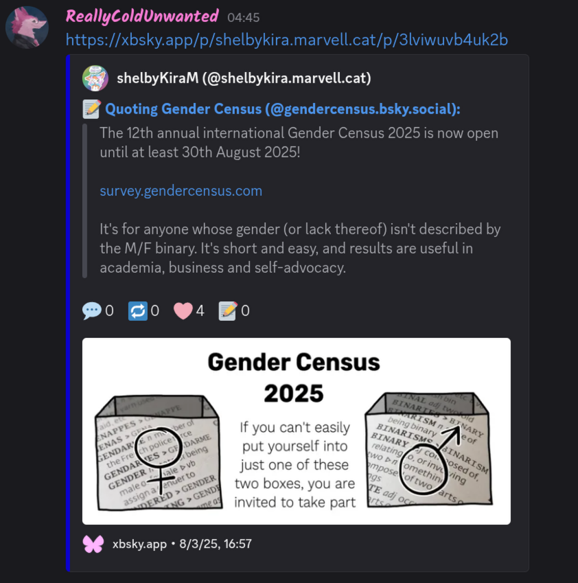

> [!TIP]
> This can also be applied to profiles, feeds, lists, and starter packs, in the following format:
> 
> `https://xbsky.app/p/handle.xyz` - for profiles
> 
> `https://xbsky.app/p/handle.xyz/p/recordkey` - for posts
> 
> `https://xbsky.app/p/handle.xyz/p/recordkey/p/photonumber` - for posts to select a specific photo
> 
> `https://xbsky.app/p/handle.xyz/f/recordkey` - for feeds
> 
> `https://xbsky.app/p/handle.xyz/l/recordkey` - for lists
>
> `https://xbsky.app/p/handle.xyz/sp/handle.xyz/recordkey` - for starter packs

 

If the account has a .bsky.social handle, it is possible to shorten the URLs even further

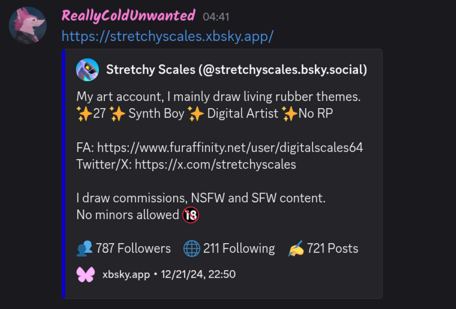
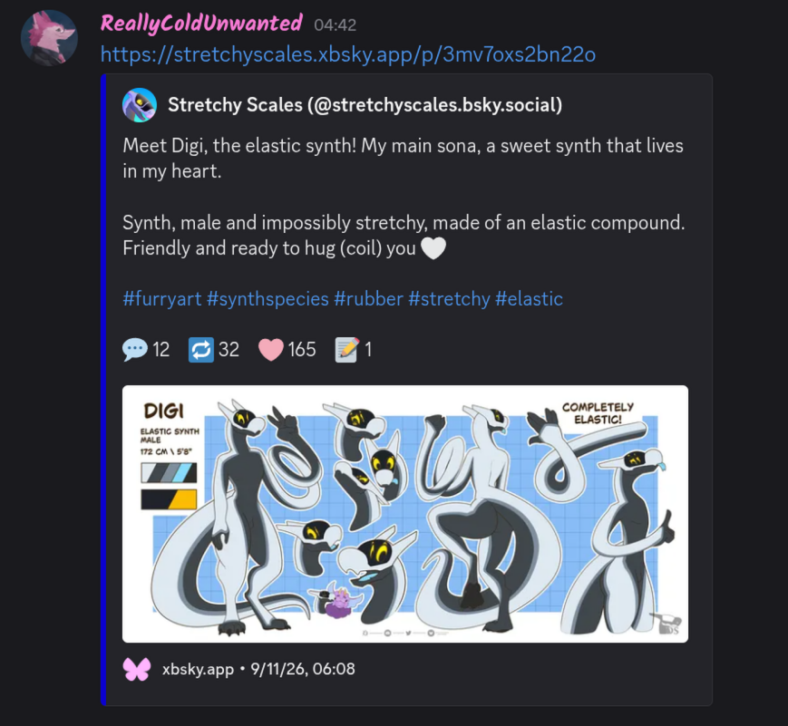

> [!CAUTION]
> This is only supported if Cloudflare is used, and does not work out of the box.
>
> You will need to create an A/AAAA wildcard DNS record with the `*` name to your domain, ie: `*.domain.com`, with the IP `192.0.2.1` for an A record, or `100::` for an AAAA record. See: https://developers.cloudflare.com/dns/manage-dns-records/reference/wildcard-dns-records/ and https://developers.cloudflare.com/fundamentals/manage-domains/redirect-domain/
>
> Additionally, you'll need to create a `Redirect rule`. Select `Custom filter expression` in `If incoming requests match...`, and use the following in `When incoming requests match...`'s `Edit expression`:
>
> `(not starts_with(http.host, "raw.") and not starts_with(http.host, "mosaic.") and not starts_with(http.host, "api.") and http.host ne "xbsky.app [change me]")`, change the last `http.host ne` to your own domain
>
> Then, in the `Then...` section, change the type to `Dynamic`, and use the following in the `Expression` field: `wildcard_replace(http.request.full_uri, "https://*.xbsky.app*", "https://xbsky.app/p/${1}.bsky.social${2}")`. Changing `xbsky.app` to your own domain.

 

A text only post with an external embed (Telegram)

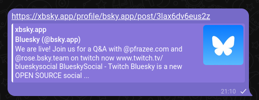
 

A text only, quote post (Telegram)

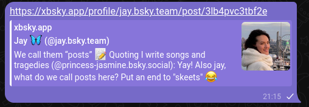
 

A reply post with two images, horizontally stacked for the image preview (Telegram only; all images are available in Instant View)

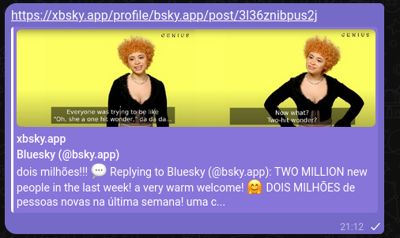
 

A video post (Telegram)

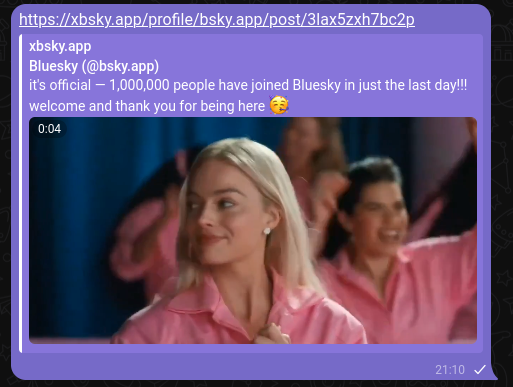
 

# Note
- This project was done as practice, if you encounter any bugs, errors, or whatnot, or just have a suggestion, feel free to reach out to me:
    - On [Discord (@reallycoldunwanted)](https://discord.com/users/928010351583330414)
    - On [Bluesky](https://bsky.app/profile/did:plc:wva5j7anzlh4dbl42g23stun)
    - Or, of course, [here on GitHub](https://github.com/colduw/xbsky/issues)
